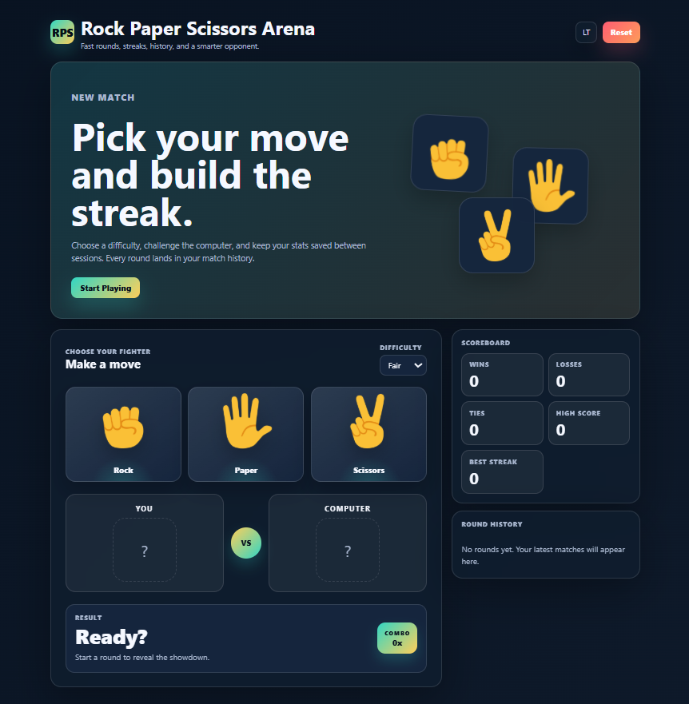
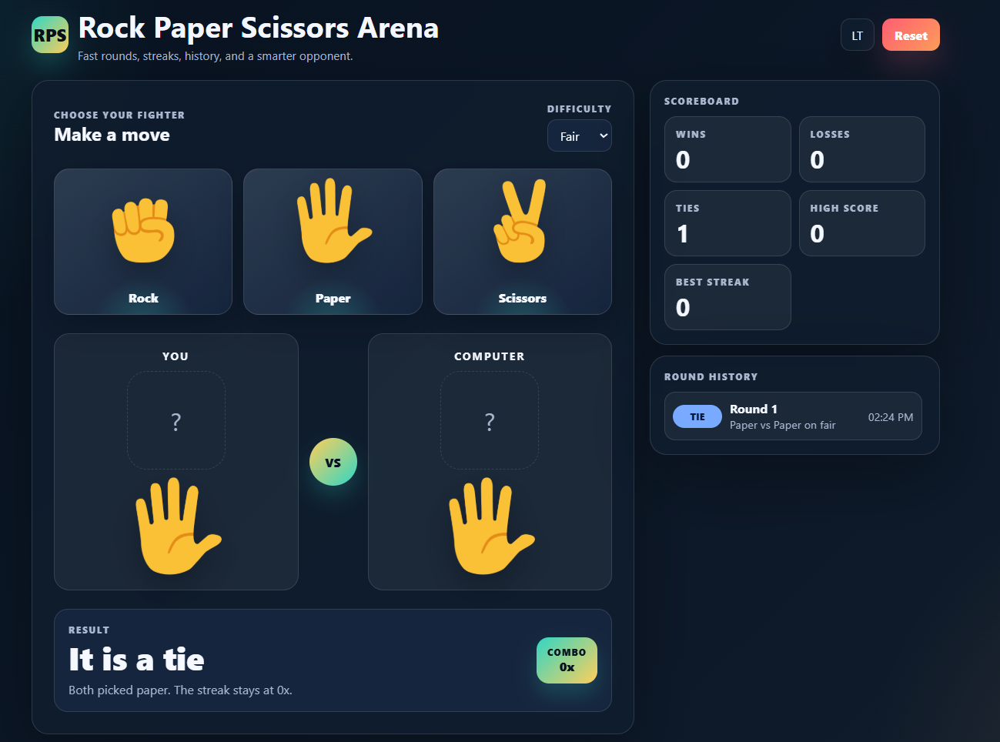
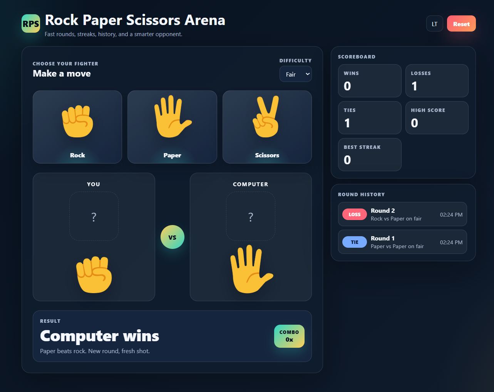
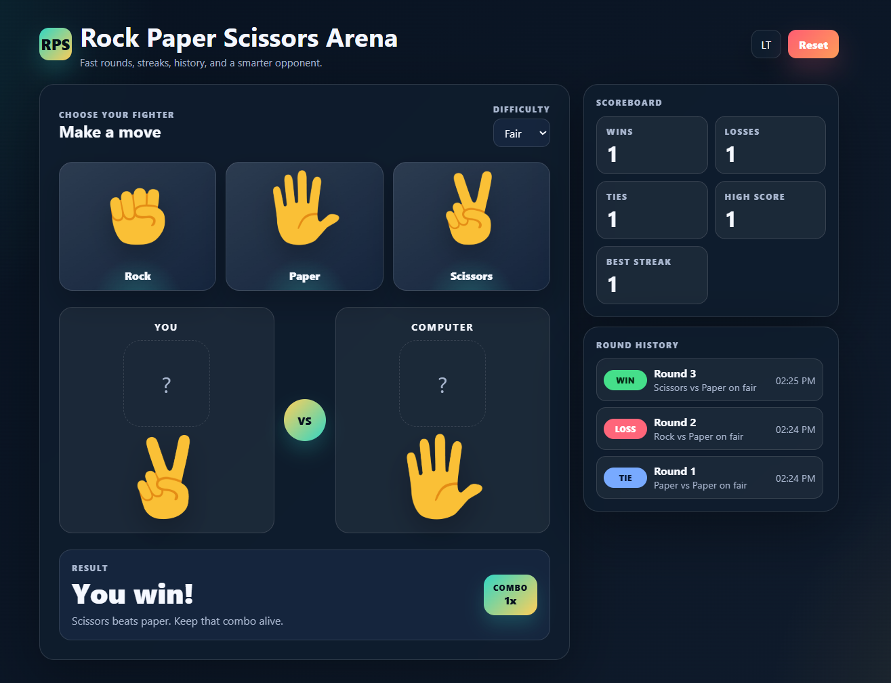

#  Rock, Paper, Scissors – Web Game
<p align=justify>
A simple, interactive Rock, Paper, Scissors game built using HTML, CSS, and JavaScript. Play against the computer, track your score, and enjoy a responsive user interface with smooth animations and persistent score storage using localStorage.
</p>

---

##  Features

- Randomized computer choice
- Clickable emoji buttons
- Win, loss, and tie score tracking
- Score saved using localStorage
- Emoji-based visual feedback
- Reset option to clear the game
- Responsive and stylish UI

---

##  Built With

- HTML5
- CSS3
- JavaScript (ES6)

---

##  Gallery

<table>
  <tr>
    <td></td>
    <td></td>
  </tr>
  <tr>
    <td></td>
    <td></td>
  </tr>
</table>

## Files

```bash
game.html
style.css
script.js

